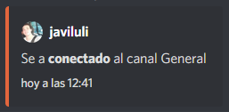
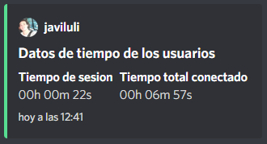
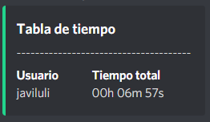

# Salu2 - Bot de Discord

Permite **contar el tiempo** de conexión de cada usuario del servidor, tanto el tiempo de sesión como el tiempo total conectado al servidor.

## Requisitos

Es necesario tener un Token-Bot generado en la creación del bot en [Discord Developer Portal](https://discord.com/developers/applications).

También necesitas obtener el ID del canal de texto donde el bot enviara los mensajes.

## Funcionalidad principal

La función principal del bot es generar un mensaje embebido cada vez que un usuario se conecta y desconecta de cualquier canal del servidor.

```js
// ID del chat de texto al cual asociar el bot
const ID_TEXT_CHANNEL = process.env.ID_TEXT_CHANNEL

// se detecta una conexión o desconexión de un chat de voz del servidor
client.on('voiceStateUpdate', (oldVoice, newVoice) => {
  // usuario conectado o desconectado
  const user = client.users.cache.get(newVoice.id)

  // canal de texto donde enbia el bot los mensajes embebidos
  const textChannel = client.channels.cache.get(ID_TEXT_CHANNEL)

  // canal de voz donde se desconecta la conexion
  const oldvoice = client.channels.cache.get(oldVoice.channelID)

  // canal de voz del que se conecta
  const newvoice = client.channels.cache.get(newVoice.channelID)

  let embed = new Discord.MessageEmbed()
    .setAuthor(user.username, user.avatarURL({ dynamic: true }))
    .setColor('RANDOM')
    .setTimestamp()

  // esta condición se cumple solo la primera vez que se conecta al primer canal de voz, eliminando la segunda condición ( && !oldvoice ) el bot detectara la reconexión de chat de voz distinto sin llegarse a abandonar el servidor
  if (newvoice && !oldvoice) {
    embed.setDescription(`Se a **conectado** al canal ${newvoice.name}`)
    textChannel.send(embed)
  }

  // detecta la desconexión del servidor
  if (oldvoice && !newvoice) {
    embed.setDescription(`Se a **desconectado** del server`)
    textChannel.send(embed)
  }
})
```

Con esta función se implementan otras funciones como el recuento de tiempo que un usuario se conecta en una sesión y cuando tiempo total se ha conectado al servidor.

Mensaje de conexión



Mensaje de desconexión



> Nota: la información de cada usuario se almacena en un Map() de javascript, algo sencillo pero rápido de programar, para que los datos perduren se deberá utilizar una BD u otro método de almacenar información, ya que cada vez que se reinicie el bot los datos almacenados en el Map() se eliminaran.

## Comandos disponibles

### `!table`

Permite visualizar en un mensaje embebido todos los usuarios y su total de tiempo de conexión al servidor, este no mostrará los usuarios que no se hayan conectado al menos 1 segundo.


